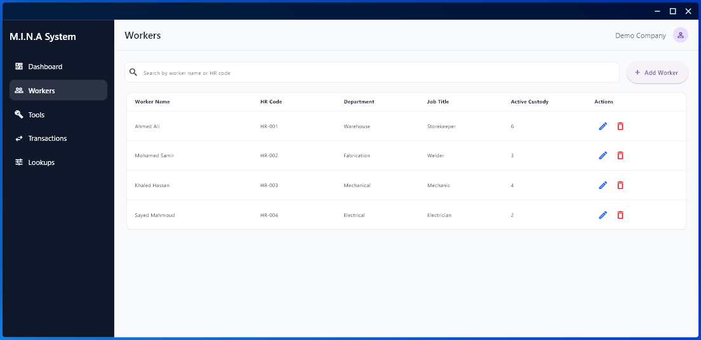
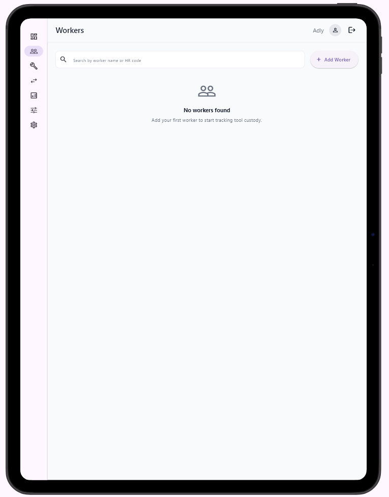
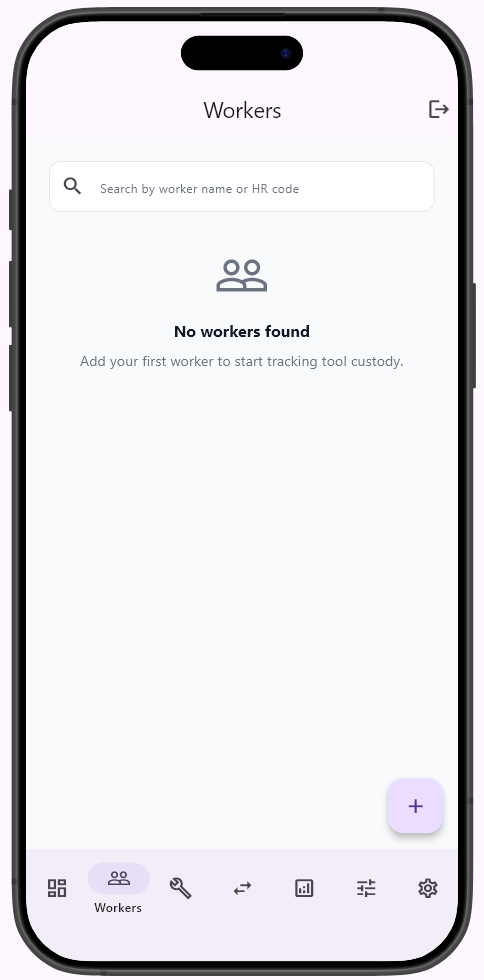
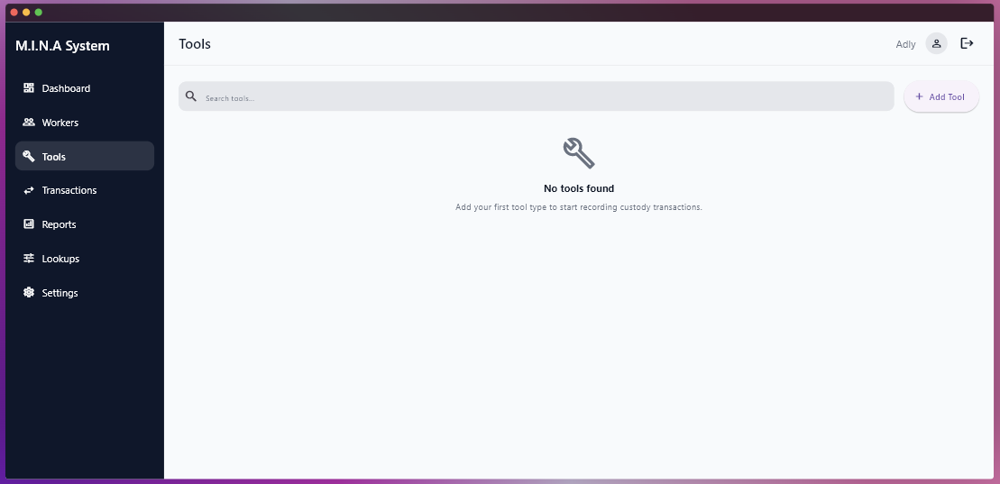
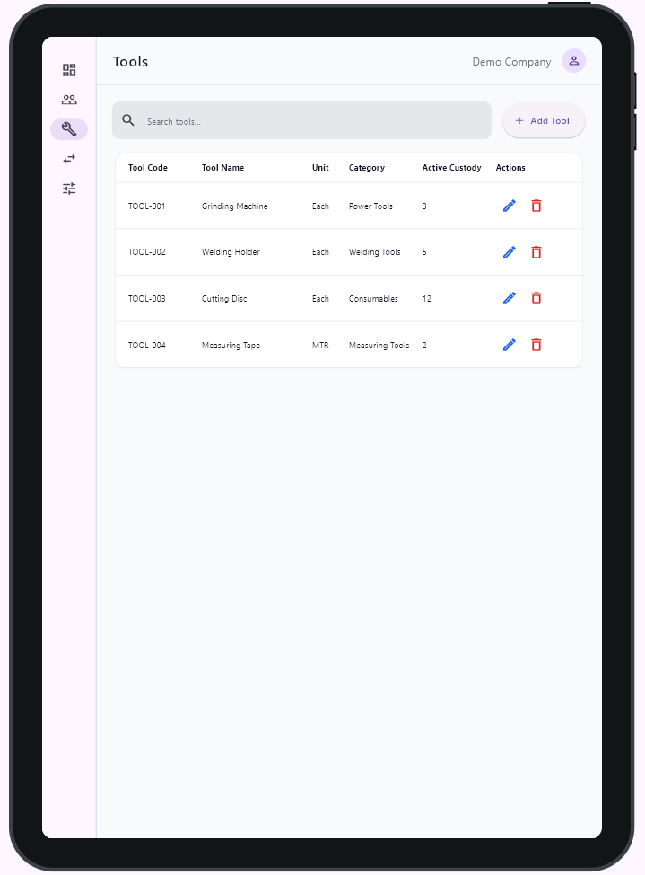
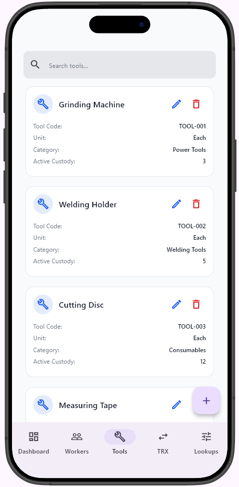
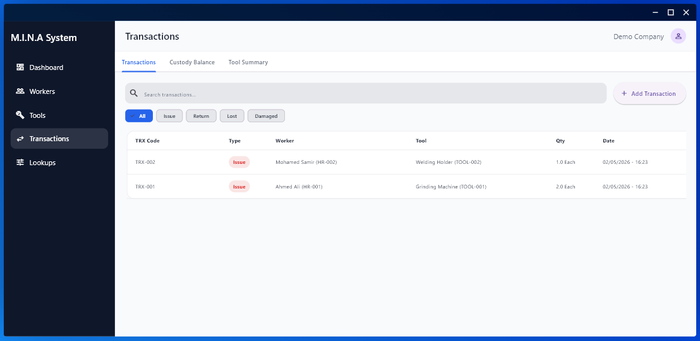
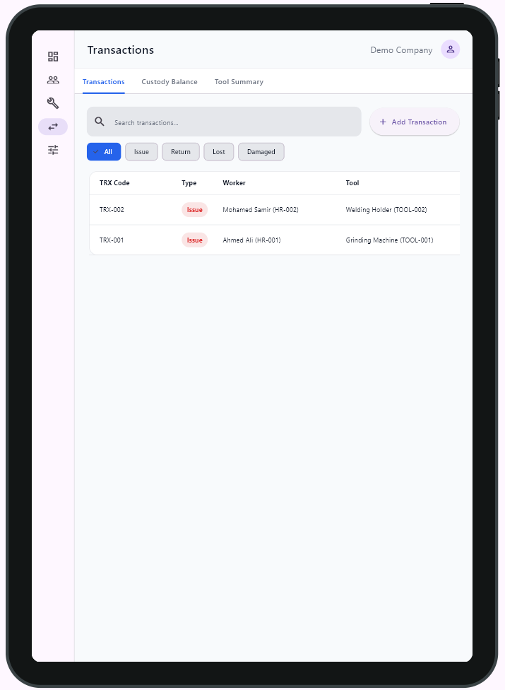
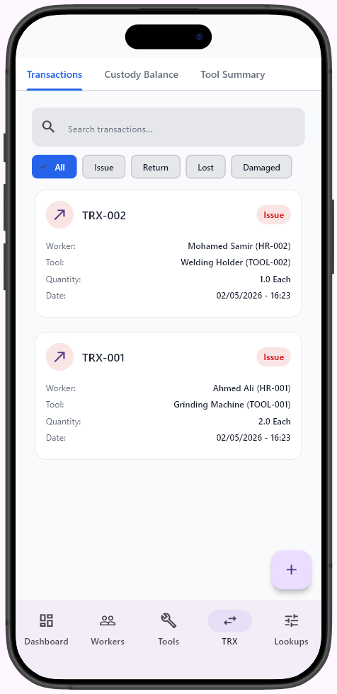

# M.I.N.A System

**M.I.N.A System** stands for **Materials Inventory Navigation Assistant**.

M.I.N.A System is a Flutter-based warehouse custody and inventory management application designed to help companies manage workers, tools, custody transactions, inventory records, and operational accountability in one organized system.

> **Project Status:** Under Development  
> **Current Stage:** Responsive UI foundation + Core modules structure  
> **Future Vision:** Online, multi-company, multi-user, role-based inventory and custody management platform

---

## Project Overview

M.I.N.A System is the new and upgraded version of a previous offline/local tools tracking system.

The first version was built to solve a real warehouse problem: tracking issued tools, returned tools, workers' custody, and basic reports inside a local workflow.

The new version is being redesigned with a larger vision:

- Online access instead of offline-only usage
- Multi-company support
- Multiple users
- Role-based permissions
- Responsive design for desktop, tablet, and mobile
- Cleaner and more scalable project structure
- Better user experience for warehouse teams and management

This project is not only a coding practice project.  
It is based on real warehouse operations, real custody tracking needs, and real accountability challenges.

---

## Key Goals

The main goal of M.I.N.A System is to help warehouse teams:

- Track tools issued to workers
- Track returned tools
- Monitor open custody balances
- Manage worker records
- Manage tool records
- Organize lookup data such as departments, job titles, units, and categories
- Improve accountability and reduce manual tracking errors
- Prepare the system for future online and multi-company usage

---

## Current Features Implemented

The current version includes the following modules and UI foundations:

- Responsive login screen
- Dashboard screen
- Workers management screen
- Tools management screen
- Transactions screen
- Custody transaction tabs
- Lookup navigation item
- Mobile bottom navigation
- Tablet navigation rail
- Desktop side menu
- Search UI for workers, tools, and transactions
- Add / edit / delete action buttons in module screens
- Static/mock data structure for development and UI testing
- Cubit-based state management foundation
- Reusable layout structure

---

## Planned Features

The project is still under development. The next planned stages include:

- Real online database integration
- Real authentication system
- Multi-company structure
- Multi-user access
- Role-based permissions
- User profile and company profile management
- Persistent login/session handling
- Full CRUD operations connected to database
- Issue and return workflows
- Lost and damaged tool workflows
- Custody balance calculations
- Reports generation
- PDF export
- Image/photo attachment support for transactions
- Advanced search and filtering
- Production-ready error handling
- Deployment preparation for web/mobile platforms

---

## Responsive Design

M.I.N.A System is designed to work across different screen sizes.

| Device Type | Layout Style |
|---|---|
| Mobile | Bottom Navigation |
| Tablet | Navigation Rail |
| Desktop | Side Menu |

The goal is to make the system usable by different users in different environments:

- Warehouse staff using phones
- Supervisors using tablets
- Office/admin users using desktop screens

---

## Screenshots

### Dashboard

| Desktop | Tablet | Mobile |
|---|---|---|
|  |  |  |

---

### Login Screen

| Desktop | Tablet | Mobile |
|---|---|---|
|  |  |  |

---

### Workers Module

| Desktop | Tablet | Mobile |
|---|---|---|
|  |  |  |

---

### Tools Module

| Desktop | Tablet | Mobile |
|---|---|---|
|  |  |  |

---

### Transactions Module

| Desktop | Tablet | Mobile |
|---|---|---|
|  |  |  |

---

## App Modules

### 1. Dashboard

The dashboard gives a quick overview of the system.

Current dashboard cards include:

- Total Workers
- Total Tools
- Open Custodies
- Returned Today
- Recent Transactions
- Quick Actions

The current data is mock/static data for development purposes.

---

### 2. Workers

The Workers module is designed to manage worker records.

Current UI includes:

- Worker list
- Search field
- Worker name
- HR code
- Department
- Job title
- Active custody count
- Add worker button
- Edit and delete actions

---

### 3. Tools

The Tools module is designed to manage tools and inventory-related items.

Current UI includes:

- Tool list
- Search field
- Tool code
- Tool name
- Unit
- Category
- Active custody count
- Add tool button
- Edit and delete actions

---

### 4. Transactions

The Transactions module is designed to manage tool custody movements.

Current UI includes:

- Transaction list
- Search field
- Transaction type filter
- Tabs for:
  - Transactions
  - Custody Balance
  - Tool Summary
- Transaction types:
  - Issue
  - Return
  - Lost
  - Damaged

---

### 5. Lookups

The Lookups module is planned to manage reusable system data such as:

- Departments
- Job titles
- Tool units
- Tool categories

This helps keep the system flexible and easier to maintain as the company structure changes.

---

## Technology Stack

The project is currently built using:

- Flutter
- Dart
- Flutter Bloc / Cubit
- GoRouter
- Device Preview
- Gap package
- Material Design

Useful references:

- [Flutter Documentation](https://docs.flutter.dev/)
- [Dart Documentation](https://dart.dev/guides)
- [Flutter Bloc Package](https://pub.dev/packages/flutter_bloc)
- [GoRouter Package](https://pub.dev/packages/go_router)
- [Device Preview Package](https://pub.dev/packages/device_preview)
- [Gap Package](https://pub.dev/packages/gap)

---

## Current Project Structure

```text
lib
├── app_root
│   └── app_root.dart
│
├── core
│   ├── constants
│   ├── layout
│   ├── responsive
│   ├── routes
│   ├── theme
│   ├── validators
│   └── widgets
│
├── features
│   ├── auth
│   │   └── presentation
│   │       ├── cubit
│   │       ├── layouts
│   │       ├── screens
│   │       └── widgets
│   │
│   ├── dashboard
│   │   └── presentation
│   │       ├── screens
│   │       └── widgets
│   │
│   ├── workers
│   │   ├── data
│   │   │   └── models
│   │   └── presentation
│   │       ├── cubit
│   │       ├── screens
│   │       └── widgets
│   │
│   ├── tools
│   │   ├── data
│   │   │   └── models
│   │   └── presentation
│   │       ├── cubit
│   │       ├── screens
│   │       └── widgets
│   │
│   ├── transactions
│   │   ├── data
│   │   │   └── models
│   │   └── presentation
│   │       ├── cubit
│   │       ├── screens
│   │       └── widgets
│   │
│   └── lookups
│       └── presentation
│           ├── cubit
│           ├── screens
│           └── widgets
│
└── main.dart
```

---

## Getting Started

### 1. Clone the repository

```bash
git clone https://github.com/KingNarmar/mina_system.git
```

### 2. Navigate to the project folder

```bash
cd mina_system
```

### 3. Install dependencies

```bash
flutter pub get
```

### 4. Run the project

```bash
flutter run
```

---

## Run on Different Platforms

### Run on Chrome

```bash
flutter run -d chrome
```

### Run on Windows

```bash
flutter run -d windows
```

### Run on Android Emulator

```bash
flutter run
```

---

## Development Notes

- The project is still under development.
- Current data is mainly static/mock data for UI and logic testing.
- The current focus is building the responsive UI foundation and core modules.
- The next major step is connecting the system to a real online backend/database.
- The final vision is to make the system suitable for real companies with multiple users and different permissions.

---

## Project Vision

M.I.N.A System is being built to become more than a simple tracking app.

The long-term vision is to create a practical warehouse custody and inventory management platform that can support:

- Real company operations
- Different departments
- Different users
- Different permission levels
- Online access
- Accurate custody tracking
- Better accountability

---

## About the Project Name

**M.I.N.A** = **Materials Inventory Navigation Assistant**

The name reflects the purpose of the system:

To help warehouse teams navigate, control, and manage inventory and custody operations in a structured and professional way.

---

## Author

Developed by **Mina Adly**

Warehouse Manager and Flutter developer building practical software solutions based on real warehouse and inventory management experience.