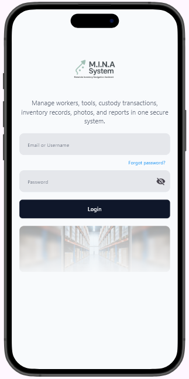
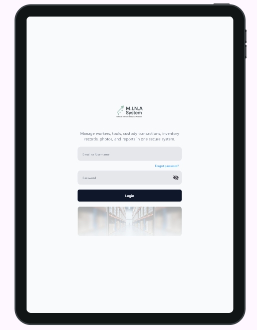
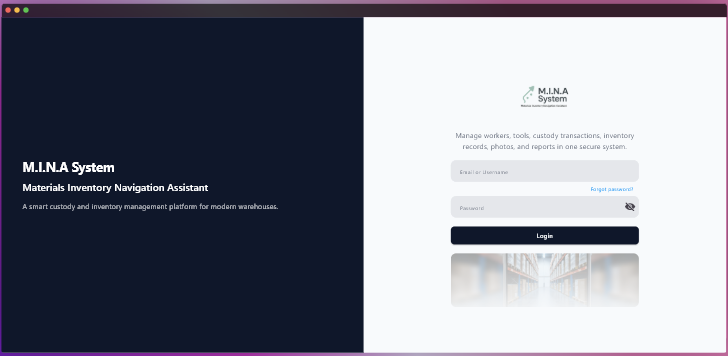
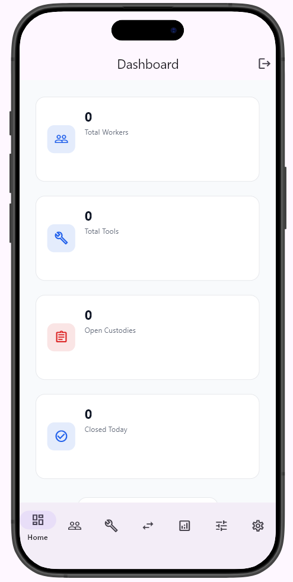
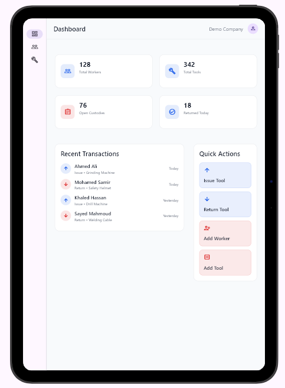
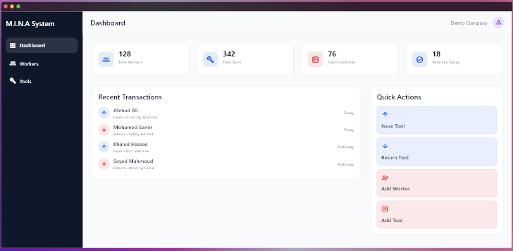

# M.I.N.A System

**M.I.N.A System** stands for **Materials Inventory Navigation Assistant**.

M.I.N.A System is a Flutter-based warehouse custody and inventory management application designed to help manage workers, tools, custody transactions, inventory records, photos, and reports in one organized system.

> Project status: **Under Development**  
> Current stage: **Responsive UI foundation + Login flow + Dashboard layout**

---

## 📌 Project Overview

This project is being built as a modern warehouse management system that supports multiple screen sizes, including:

- Mobile
- Tablet
- Desktop

The current version focuses on preparing the main structure of the app, including authentication UI, responsive layouts, dashboard design, reusable core widgets, and navigation shells.

---

## ✅ Current Progress

The project currently includes:

- Responsive app structure for mobile, tablet, and desktop.
- Login screen with separate layouts for each screen size.
- Basic demo authentication using `AuthCubit`.
- Dashboard screen with statistics cards.
- Recent transactions preview card.
- Quick actions card.
- Main app shell with different navigation styles based on screen size.
- Centralized theme, colors, text styles, validators, and reusable widgets.
- Placeholder screens for Workers and Tools modules.

---

## 🔐 Demo Login

The current login flow uses demo credentials for testing only.

| Field | Value |
|---|---|
| Username | `admin` |
| Password | `123456` |

After successful login, the user is redirected to the dashboard.

---

## 🖥️ Responsive Layout System

The app uses a responsive layout system based on screen width.

| Device Type | Breakpoint |
|---|---|
| Mobile | Less than `600px` |
| Tablet | From `600px` to less than `1024px` |
| Desktop | `1024px` and above |

The responsive logic is handled through:

```text
lib/core/responsive/app_breakpoints.dart
lib/core/responsive/responsive_layout.dart
```

---

## 📱 Navigation System

The application uses different navigation styles depending on the screen size:

| Screen Type | Navigation Type |
|---|---|
| Mobile | Bottom Navigation Bar |
| Tablet | Navigation Rail |
| Desktop | Side Menu |

Navigation items currently available:

- Dashboard
- Workers
- Tools

---

## 📸 Screenshots

| Screen | Layout | Preview |
|---|---|---|
| Login Screen | Mobile |  |
| Login Screen | Tablet |  |
| Login Screen | Desktop |  |
| Dashboard Screen | Mobile |  |
| Dashboard Screen | Tablet |  |
| Dashboard Screen | Desktop |  |

---

## 🧱 Project Structure

```text
lib
├── app_root
│   └── app_root.dart
│
├── core
│   ├── constants
│   │   └── app_images.dart
│   │
│   ├── layout
│   │   ├── app_nav_item.dart
│   │   ├── app_nav_items.dart
│   │   ├── app_shell.dart
│   │   ├── app_top_bar.dart
│   │   ├── desktop_shell.dart
│   │   ├── mobile_shell.dart
│   │   └── tablet_shell.dart
│   │
│   ├── responsive
│   │   ├── app_breakpoints.dart
│   │   └── responsive_layout.dart
│   │
│   ├── routes
│   │   └── routes.dart
│   │
│   ├── theme
│   │   ├── app_colors.dart
│   │   ├── app_text_styles.dart
│   │   └── app_theme.dart
│   │
│   ├── validators
│   │   └── app_validators.dart
│   │
│   └── widgets
│       ├── custom_text_form_field.dart
│       ├── main_button.dart
│       └── password_text_form_field.dart
│
├── features
│   ├── auth
│   │   └── presentation
│   │       ├── cubit
│   │       │   ├── auth_cubit.dart
│   │       │   └── auth_state.dart
│   │       │
│   │       ├── layouts
│   │       │   ├── login_desktop_layout.dart
│   │       │   ├── login_mobile_layout.dart
│   │       │   └── login_tablet_layout.dart
│   │       │
│   │       ├── screens
│   │       │   └── login_screen.dart
│   │       │
│   │       └── widgets
│   │           └── login_form.dart
│   │
│   ├── dashboard
│   │   └── presentation
│   │       ├── screens
│   │       │   └── dashboard_screen.dart
│   │       │
│   │       └── widgets
│   │           ├── dashboard_stat_card.dart
│   │           ├── quick_action_card.dart
│   │           └── recent_transactions_card.dart
│   │
│   ├── tools
│   │   └── presentation
│   │       └── screens
│   │           └── tools_screen.dart
│   │
│   └── workers
│       └── presentation
│           └── screens
│               └── workers_screen.dart
│
└── main.dart
```

---

## 🧩 Main Features Implemented

### 1. Login Module

The login module includes:

- Responsive login layouts.
- Mobile, tablet, and desktop versions.
- Form validation.
- Password visibility toggle.
- Demo login using Cubit state management.
- Loading state during login.
- Error message when login credentials are incorrect.
- Navigation to dashboard after successful login.

Main files:

```text
lib/features/auth/presentation/screens/login_screen.dart
lib/features/auth/presentation/widgets/login_form.dart
lib/features/auth/presentation/cubit/auth_cubit.dart
lib/features/auth/presentation/cubit/auth_state.dart
```

---

### 2. Dashboard Module

The dashboard currently displays mock data to represent the future system overview.

Current dashboard sections:

- Total Workers
- Total Tools
- Open Custodies
- Returned Today
- Recent Transactions
- Quick Actions

Main files:

```text
lib/features/dashboard/presentation/screens/dashboard_screen.dart
lib/features/dashboard/presentation/widgets/dashboard_stat_card.dart
lib/features/dashboard/presentation/widgets/recent_transactions_card.dart
lib/features/dashboard/presentation/widgets/quick_action_card.dart
```

---

### 3. App Shell

The app shell controls the main layout after login.

It automatically switches between:

- `MobileShell`
- `TabletShell`
- `DesktopShell`

Main files:

```text
lib/core/layout/app_shell.dart
lib/core/layout/mobile_shell.dart
lib/core/layout/tablet_shell.dart
lib/core/layout/desktop_shell.dart
```

---

### 4. Core Design System

The project includes a simple core design system to keep the UI consistent.

Included core files:

```text
lib/core/theme/app_colors.dart
lib/core/theme/app_text_styles.dart
lib/core/theme/app_theme.dart
```

The design system currently includes:

- App colors
- Text styles
- Light theme
- Shared button widget
- Shared text field widget
- Shared password field widget

---

## 🛠️ Technologies & Packages Used

The current code uses:

- Flutter
- Material 3
- GoRouter
- Flutter Bloc / Cubit
- Device Preview
- Gap package

References:

- Flutter Documentation: <https://docs.flutter.dev/>
- Material 3 in Flutter: <https://docs.flutter.dev/ui/design/material>
- GoRouter Package: <https://pub.dev/packages/go_router>
- Flutter Bloc Package: <https://pub.dev/packages/flutter_bloc>
- Device Preview Package: <https://pub.dev/packages/device_preview>
- Gap Package: <https://pub.dev/packages/gap>

---

## 🚧 What Is Still Under Development

The project is still in an early development stage.

The following parts are not fully implemented yet:

- Real database integration.
- Real authentication.
- Workers management module.
- Tools management module.
- Issue and return tool transactions.
- Reports generation.
- Image capture for issue/return transactions.
- Inventory balance calculations.
- User roles and permissions.
- Search and filtering.
- Exporting reports.
- Production-ready error handling.
- Persistent login/session handling.

---

## 📍 Current App Flow

```text
main.dart
   ↓
MinaSystem
   ↓
MaterialApp.router
   ↓
LoginScreen
   ↓
AuthCubit demo login
   ↓
AppShell
   ↓
Dashboard / Workers / Tools
```

---

## 🚀 Getting Started

### 1. Install dependencies

```bash
flutter pub get
```

### 2. Run the app

```bash
flutter run
```

### 3. Run on desktop

```bash
flutter run -d windows
```

### 4. Run on web

```bash
flutter run -d chrome
```

---

## 📂 Assets Used

The project currently depends on these image assets:

```text
assets/images/Logo.png
assets/images/login_pic.png
```

Make sure these assets are correctly added in `pubspec.yaml`.

---

## 📝 Notes

- The current dashboard data is static mock data.
- The Workers screen is currently a placeholder.
- The Tools screen is currently a placeholder.
- The current login system is for demo/testing only.
- The project structure is already prepared to grow into a complete warehouse custody and inventory management system.
- The app is designed to be responsive from the beginning, which makes it suitable for future use on warehouse tablets, desktop devices, and mobile devices.

---

## 📌 Next Planned Steps

The next development stages can include:

- Building the Workers module.
- Building the Tools module.
- Creating the Transactions module.
- Connecting the app to a local or cloud database.
- Adding real CRUD operations.
- Adding issue and return workflows.
- Adding custody balance calculations.
- Adding reports and PDF export.
- Adding user login persistence.
- Adding role-based access control.

---

## 👨‍💻 Project Name Meaning

**M.I.N.A** = **Materials Inventory Navigation Assistant**

The name reflects the purpose of the application: helping warehouse teams navigate, control, and manage inventory and custody operations in a structured and reliable way.
